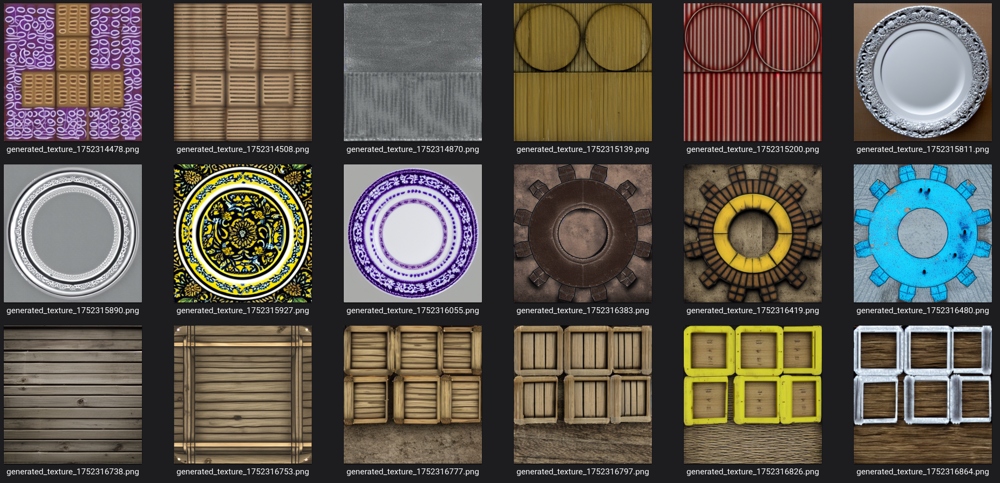
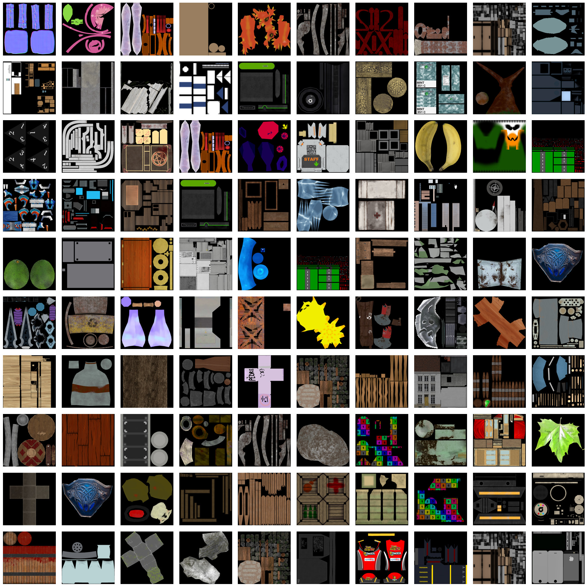
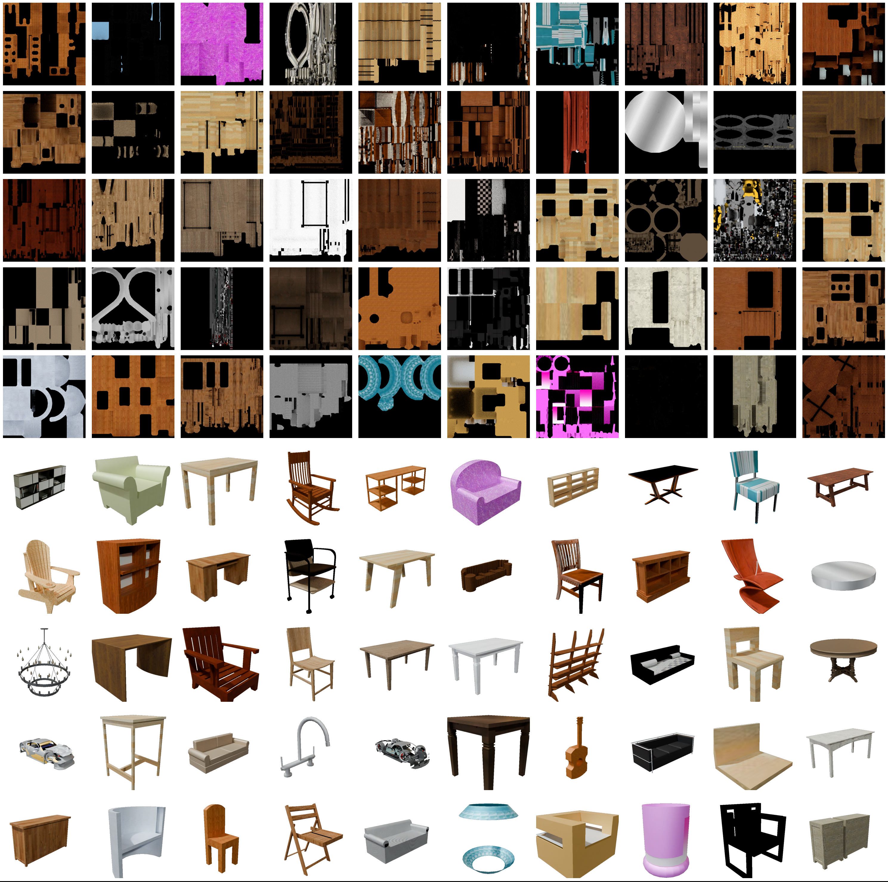
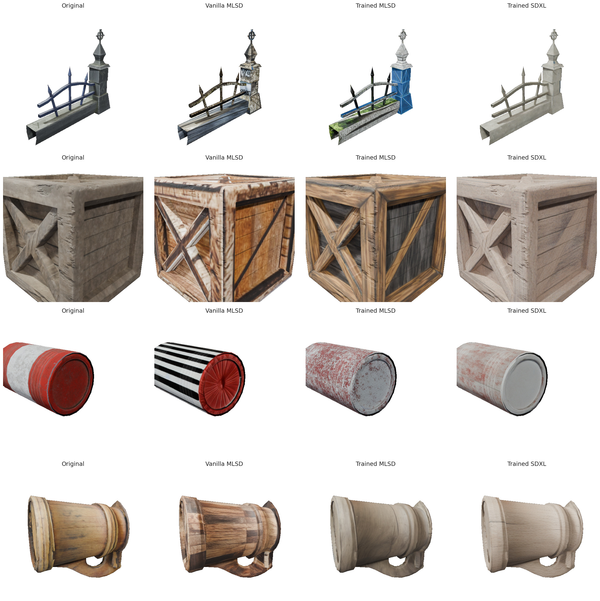

# Texture-Anything: a Blender add-on for generating textures using ControlNet UV-map conditioning

    </img>

### 📘 Thesis - *Texture Anything* [`.PDF`](notes/Texture-Anything.pdf) 
### 📙 Slideshow (Now with a video demo!) - *Texture Anything* [`.PPTX`](notes/Texture-Anything-Slideshow.pptx)

## 📌 TL;DR

The goal of this project is to train a ControlNet on UV conditioning in order to generate textures for a model given its UV map. The dataset is a mix of Objaverse and [ShapeNetCore](https://huggingface.co/datasets/ShapeNet/ShapeNetCore) and each sample is a triplet of _caption_, _uv map_ baked as image and _diffuse_ texture as ground truth.

    </img>
    </img>

## 📦 How this repository is structured

The repository is structured in cronological sections, each containing several jupyter notebooks. The [`src`](src/) module contains the code of the classes that are instantiated throughout all the notebooks.

> [!NOTE]
> **Execution Order**
> 
> As I haven't included the `.parquet` intermediary files due to their size, you should run all the notebooks one after the other, in order.

    </img>

<!-- ### 1 Annotation Filtering

Here we clean and filter the annotation from the Objaverse dataset. (From $\approx 800,000$ to $\approx 70,000$ objects)

| Notebook                                                                             | Description |
| ------------------------------------------------------------------------------------ | ----------- |
| [1.1-Filter_Annotations](1-annotations_filtering/1.1-Filter_Annotations.ipynb)       | -           |
| [1.2-Visualize_Annotations](1-annotations_filtering/1.2-Visualize_Annotations.ipynb) | -           |
| [1.3-Check_Thumbnails](1-annotations_filtering/1.3-Check_Thumbnails.ipynb)           | -           |
| [1.4-Model_Visualizer](1-annotations_filtering/1.4-Model_Visualizer.ipynb)           | -           |

### 2 Objects Filtering

The $\approx 70,000$ objects are downloaded and further filtered for properties not yet available on the annotations.

| Notebook                                                               | Description |
| ---------------------------------------------------------------------- | ----------- |
| [2.1-Filter_Objects](2-objects_filtering/2.1-Filter_Objects.ipynb)     | -           |
| [2.2-Generate_Dataset](2-objects_filtering/2.2-Generate_Dataset.ipynb) | -           |

### 3 Shape Net

The [ShapeNetCore](https://huggingface.co/datasets/ShapeNet/ShapeNetCore) dataset is downloaded and analyzed. Is it that much cleaner than Objaverse?

| Notebook                                                         | Description |
| ---------------------------------------------------------------- | ----------- |
| [3.1-Download_ShapeNet](3-shape_net/3.1-Download_ShapeNet.ipynb) | -           |
| [3.2-Model_Visualizer](3-shape_net/3.2-Model_Visualizer.ipynb)   | -           | -->
