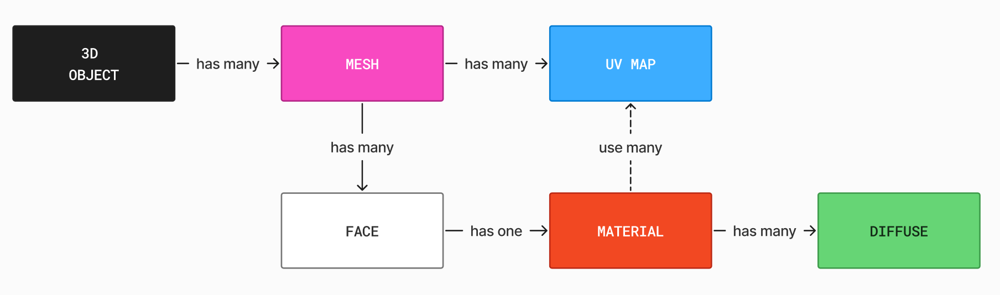

# Meshes $\perp$ UV Maps $\perp$ Diffuse Textures
How many possible scenarios can we face when we load a sample from a 3D dataset like Objaverse?

>[!NOTE]
> * $M$ = number of meshes in the 3D object.
> * $UV_i$ = number of UV‐map layers in the $i^{th}$ mesh.
> * $T_i$ = number of diffuse textures used by the $i^{th}$ mesh.
## 📌 TL;DR
If we filter out all the objects having $M=1,\,UV_0=1,\,T_0=1$ we end up discarding about $90\%$ of samples. Maybe there is a better way.

## Overview of the possibilities

For each mesh $i=1,...,M$:

|         | $UV_i=0$ | $UV_i=1$ | $UV_i=n$ |
| ------- | :------: | :------: | :------: |
| $T_i=0$ |    -     |    -     |    -     |
| $T_i=1$ |    -     |    1*    |    1     |
| $T_i=m$ |    -     |    m     |   m**    |

\* By default, the importer likely connected only one of those UV layers (e.g. “UVMap.001”) to the image node.

** You must inspect each material’s node graph to see which UV layer it is sampling.

## Materials realize the relationship between UV and diffuse textures

Materials are the missing ingredient in this recipe.

 </img>

## UV-Diffuse couples extraction algorithm
I've come up with the following algorithm:
1. If multiple meshes share the same material, **join** them, so that their UVs get merged. This *may* lead to overlapping UV drawings, solvable with texture baking. If any of the UVs spans outside the $[0,1]$ domain, discard this group of meshes.
2. TODO